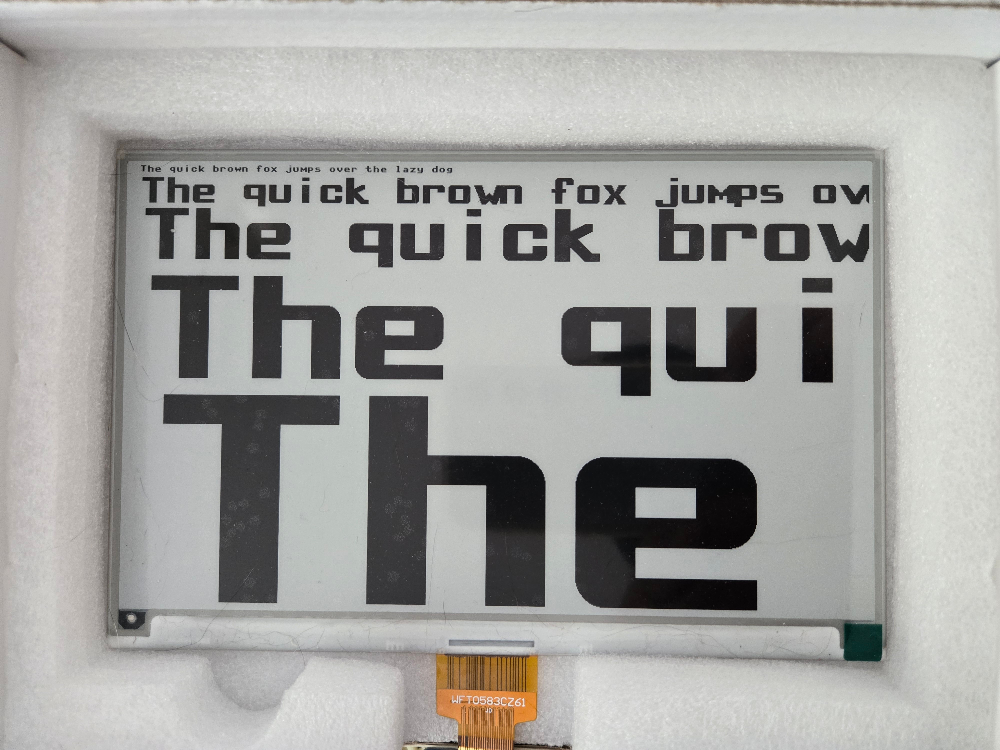

# ePaper Scalable Font
Scalable Font for WaveShare ePaper 7.5 inch in MicroPython on Raspberry Pi Pico

A slightly different approach to scaling a font. When I first started playing around with my WaveShare ePaper 7.5 inch display, it didn't take me long to discover that scaling a font the the MicroPython framebuf method wasn't possible. I seemed to be stuck with an impossible small 6 point font.

I like a puzzle as much as anyone, so I started looking for a solution. I seetled on a procedure where I print the alphabet, numbers and other keyboard symbols to the ePaper, then read them back into a file from the screen, one pixel at a time. Each letter consists of a matrix of 8 rows by 8 columns. Once I had these in a file, I could play further.

Next, when printing a letter to the screen, rather than use the FrameBuf.pixel method, I used FrameBuffer.rect where the dimension of the rectangle are determined by the font multiplier I passed as a variable. The result was a scalable font, but some charactes had 'grainy looking' appearances, as they were simply an enlargement of the 6 point font size.

So I played around some more and decided to use FrameBuf ellipse to fill in these awkwardcorners. E.g., the letter 'p' got two ellipses, one in the top right, one in the bottom right of the loop.

That still didn't help letters like the x and k, so I spent too much time making them into polygon (FrameBuf.poly), to render them that way. 

Now, to indicate to the program rendering a particular letter as to what to print, I inserted 'control characters'. Normally, the bitmap file of the font contains 0's and 1's to indicate white or black. If the program encounters a 2,3,5 or 9, it will subtract 1 from that number and then print an ellipse in the appropriate spot with the appropriate quadrant displayed. Any other character, other than the above 0,1,2,3,5 or 9, means it is going to be a polygon.

Whether I'll ever actually use it for anything, I don't know, but it was fun playing around with it. Below an image of some of the sizes, from original (barely visible) to 64.

